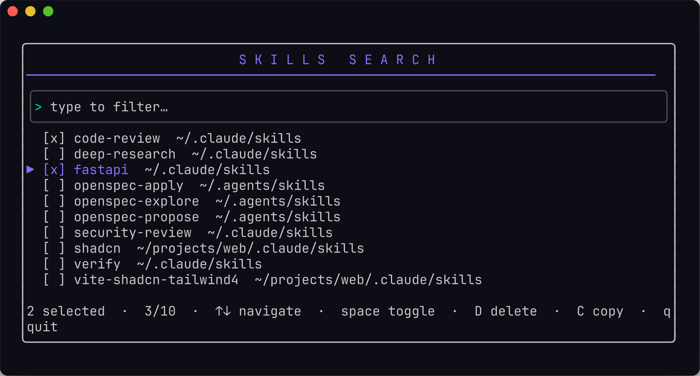
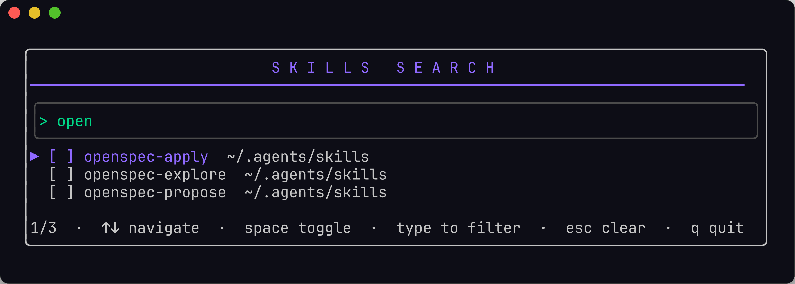
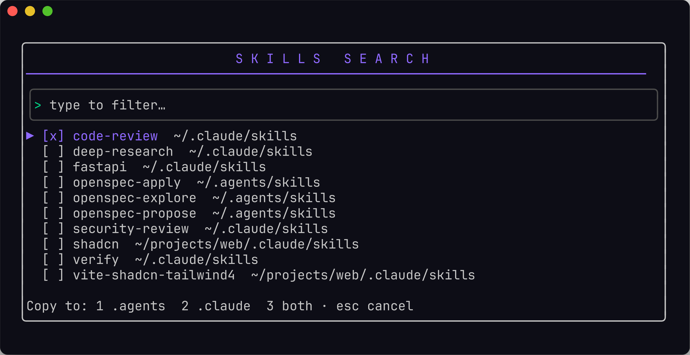

# skills-search

A fast terminal UI for browsing, copying, and pruning agent **skills** scattered
across your home directory. It finds every `skills/` directory under `$HOME`,
flattens them into one searchable list, and lets you copy skills into the current
project or delete the ones you don't need.

<p align="center">
  
</p>

## Features

- **Discovers everything** — walks `$HOME` for any `skills/` directory, skipping
  caches, `node_modules`, virtualenvs, and other noise.
- **Live fuzzy filter** — just start typing to narrow the list by name.
- **Copy into a project** — drop selected skills into `.agents/skills`,
  `.claude/skills`, or both, relative to your working directory.
- **Delete** — remove skills from disk with a confirmation step.
- **Multi-select** — selections survive filtering and auto-refresh.

## Install

```sh
go install github.com/sl-van-wyk/skills-search@latest
```

Or build from source:

```sh
git clone https://github.com/sl-van-wyk/skills-search
cd skills-search
go build -o skills-search .
```

## Usage

Run it from the project you want to copy skills *into* — the working directory is
the copy destination root:

```sh
skills-search
```

### Filter as you type

<p align="center">
  
</p>

### Copy to a destination

Select skills with `space`, press `C`, then choose where they land:

<p align="center">
  
</p>

## Keys

| Key       | Action                                            |
| --------- | ------------------------------------------------- |
| `↑` / `↓` | Move the cursor                                   |
| type      | Filter the list by name                           |
| `space`   | Toggle selection on the current row               |
| `C`       | Copy selection (or cursor row) — `1`/`2`/`3` dest |
| `D`       | Delete selection — `D` again to confirm           |
| `esc`     | Clear the filter, or quit when empty              |
| `q`       | Quit                                              |

Copy and delete act on your current selection, or on the row under the cursor
when nothing is selected. Existing destination directories are never overwritten.

## License

MIT
